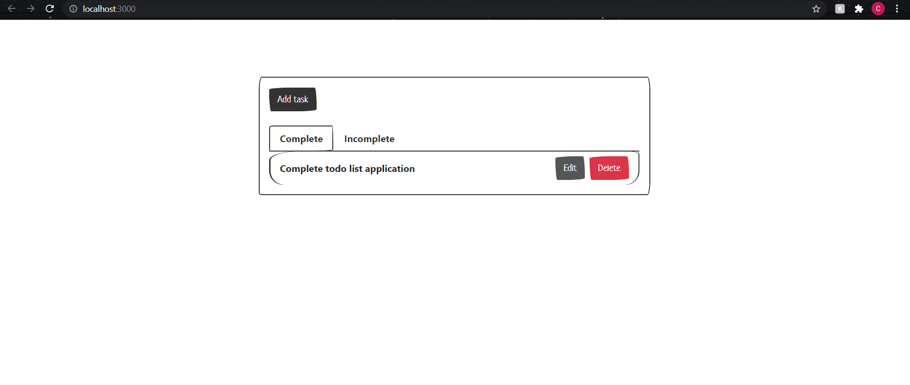
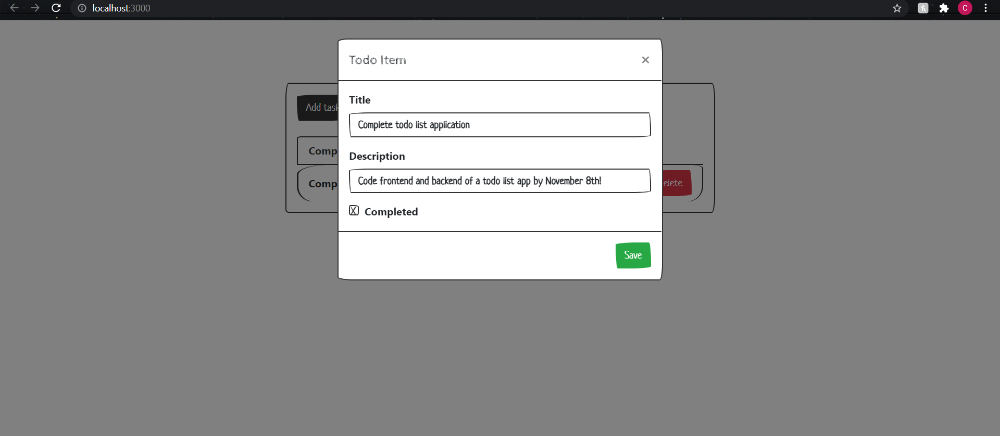
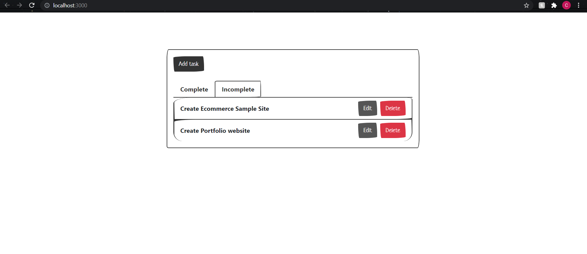
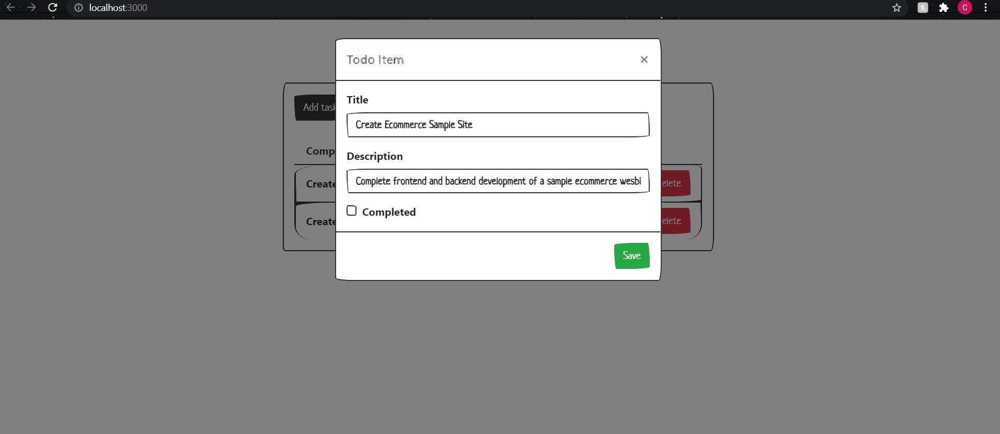

# todoApp
Using React bootstrap for the frontend and Django rest framework as the backend I created a seamless simple todo list application.

Allows user to edit completed tasks.

As well as view incomplete tasks and edit them

And of course the ability to add a new task!

And it works
